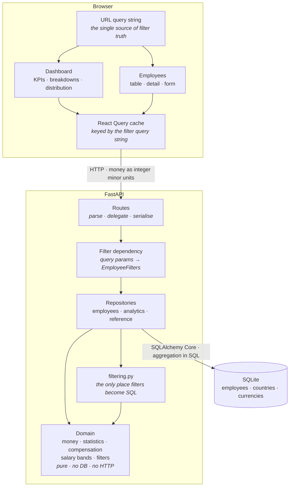
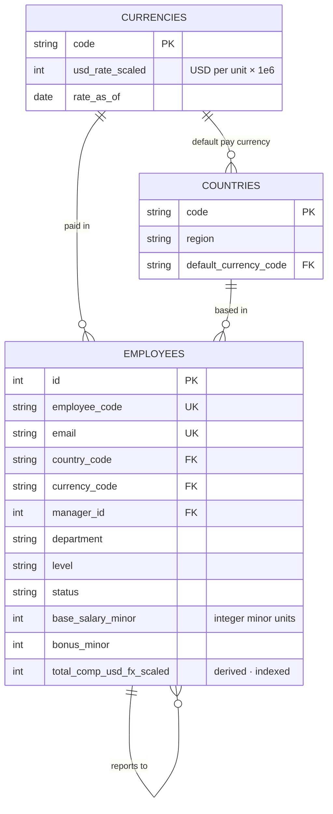

# Architecture

## Shape of the system

## Layers, and what each is allowed to know

| Layer | Knows about | Deliberately does not know about |
|---|---|---|
| `app/domain/` | Money, statistics, compensation rules, the filter value object | SQL, HTTP, FastAPI, Pydantic |
| `app/repositories/` | SQLAlchemy, the domain | HTTP, request/response shapes |
| `app/api/` | FastAPI, Pydantic, the repositories | How a median is computed, how FX is applied |
| `frontend/src/lib/` | Formatting, filter serialisation, form rules | React, the network |
| `frontend/src/api/` | Fetch, React Query, wire types | Rendering |
| `frontend/src/components/` | Rendering, Mantine | Where a number came from |

The direction of that table is the point: compensation rules are reachable from a future CSV
importer or a scheduled report without dragging a web framework along, and they are unit-testable
without a database.

## The load-bearing decision: one filter model

The persona's core job is *answering questions*, and an answer nobody can verify is worthless.
So the system guarantees, mechanically, that a headline figure and the employee list agree:

1. `EmployeeFilters` is one immutable value object (`app/domain/filters.py`).
2. `filter_conditions()` (`app/repositories/filtering.py`) is the **only** function that turns it
   into SQL. The list query, all three analytics queries, and the count query call it.
3. One FastAPI dependency parses the query parameters, and every route depends on it.
4. On the client, the filter selection lives in the URL under the parameter names the API already
   accepts, so the query string is forwarded verbatim — there is no second mapping to drift.

The result is that "€100.3M in Germany" is one click from the 903 people it is the sum of, under
exactly the same predicates. `tests/test_api.py::TestFilterConsistencyOverHttp` asserts this: the
same query string must produce the same headcount from the list and from the summary.

## Request paths

**Reading the employee list** — two queries, both over the same `WHERE` clause: a `COUNT` for the
total (so the UI can say "1–25 of 9,381" without fetching 9,381 rows) and a `LIMIT/OFFSET` page
ordered by an indexed column plus the primary key as a tiebreaker.

**Reading a dashboard panel** — the aggregate query (`COUNT`, `SUM`, `MIN`, `MAX`) and a second
windowed query for the median. Both are grouped, the summary using a constant group so it stays on
the same code path as a dimensional breakdown rather than maintaining a second, subtly different
query. The average is *not* SQL `AVG`: the integer total and count come back and the mean is taken
in the domain, because `AVG` returns a float.

**Writing an employee** — the route builds an `EmployeeDraft`, and the repository validates
references, checks uniqueness, rejects reporting cycles, and recomputes the derived USD column
through the single function that can produce it.

## Data model

Two representation choices carry most of the correctness weight, and both exist so that aggregating
10,000 salaries is exact and reproducible:

- **Money is integer minor units.** Binary floats cannot represent `0.01`, so a float `SUM` over
  10,000 rows accumulates visible drift. `tests/test_money.py` demonstrates it.
- **FX rates are integers scaled by 10⁶.** This keeps the normalisation of local pay into USD inside
  integer arithmetic, so the database can aggregate converted amounts without producing a float.
  Descaling happens once per aggregate rather than once per row, which bounds truncation error to a
  single minor unit for the whole figure instead of one per employee.

`Employee.total_comp_usd_fx_scaled` is the one piece of derived stored state. It exists so sorting
and range-filtering by USD compensation can use an index — see
[ADR-0004](adr/0004-denormalised-usd-total.md) — and `tests/test_seed.py` re-derives it for every
seeded row to prove it has not gone stale.

## What is deliberately absent

No service layer between routes and repositories: at this size it would be a pass-through. No
repository interfaces or dependency-injection container: there is one implementation, and the
session is already injected. No Alembic: the schema is created from the models and the seed is
destructive by design, which is honest for a system whose data is generated. Each of these becomes
worth adding at a specific, nameable point — a second data source, a second backend, a production
dataset that must survive a deploy — and not before.

Scope exclusions and their reasoning are in [requirements.md](requirements.md); the decisions above
are recorded individually in [docs/adr/](adr/).
